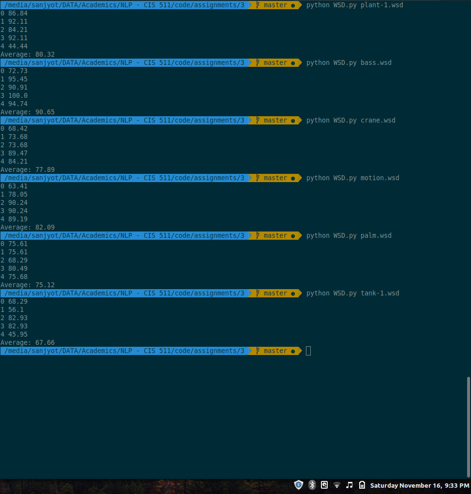

# Word sense disambiguation

Naive Bayes algorithm based word sense disambiguation implemented from scratch.

## Dependencies
Make sure you have
- Numpy
- Pandas
- NLTK

## Usage
`$ python WSD.py plant.wsd`

Program should print out accuracies on the 5-folds of dataset and write all disambiguations to `WSD.answers`.

## Result accuracies

